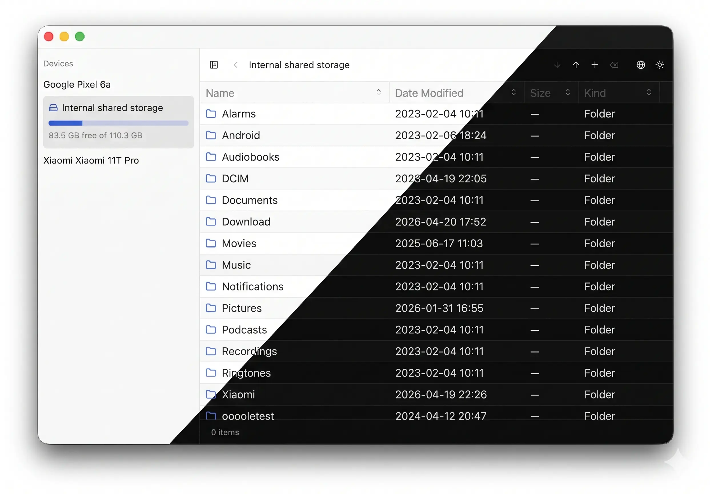

# Mulu App

[English](./README.md) | [简体中文](./README.zh-CN.md)

A cross-platform MTP client built with [gpui](https://gpui.rs), [gpui-component](https://longbridge.github.io/gpui-component) and [mtp-rs](https://github.com/vdavid/mtp-rs). Simple, easy to use, and extremely lightweight — the binary is only 8M in size.

# License

MIT OR Apache-2.0.
